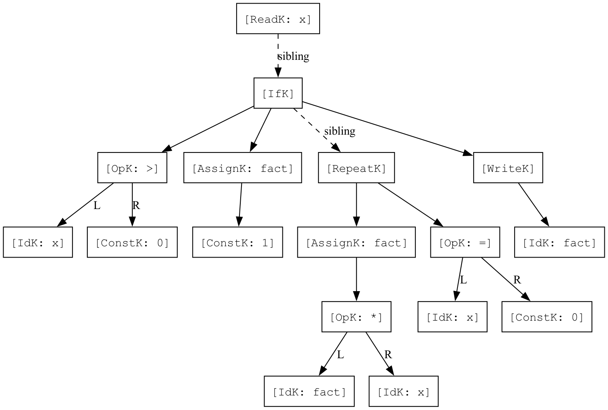
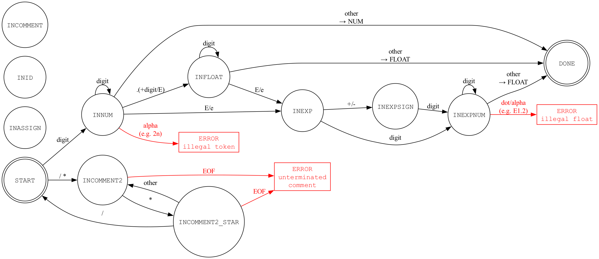
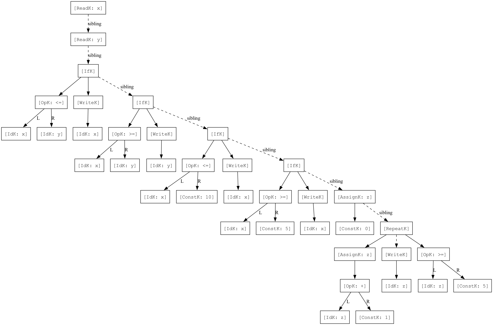

# 编译原理实验报告 - 第08周

## 一、使用的AI工具

- **DeepSeek CLI** 用于代码实现、调试和报告撰写

---

## 二、实现过程

### ① 任务分解

本次实验包含两个主要任务：

| 任务编号 | 任务名称 | 涉及文件 |
|----------|----------|----------|
| 实验一 | 在TINY编译器中添加运算符 `>` | `GLOBALS.H`, `SCAN.C`, `PARSE.C`, `CGEN.C` |
| 实验二 | TINY词法分析器扩展（浮点数、多行注释、出错处理） | `GLOBALS.H`, `UTIL.C`, `SCAN.C`, `MAIN.C` |
| 实验三（选做） | 在TINY编译器中添加运算符 `<=`、`>=` 并在虚拟机中测试 | `GLOBALS.H`, `SCAN.C`, `UTIL.C`, `PARSE.C`, `CGEN.C`, `ANALYZE.C`, `MAIN.C` |

**实验一子任务分解：**

1. 在 `GLOBALS.H` 的 `TokenType` 枚举中添加 `GT` token
2. 在 `SCAN.C` 的 DFA 中添加 `>` 字符的识别
3. 在 `PARSE.C` 的 `exp()` 函数中添加 `GT` 的语法处理
4. 在 `CGEN.C` 的 `genExp()` 函数中添加 `>` 运算符的代码生成

**实验二子任务分解：**

1. 在 `GLOBALS.H` 中添加 `FLOAT` token 类型
2. 在 `UTIL.C` 的 `printToken()` 中添加 `FLOAT` 的打印分支
3. 在 `SCAN.C` 中扩展 DFA，新增6个状态实现浮点数识别
4. 在 `SCAN.C` 中实现 `/* */` 多行注释识别
5. 在 `SCAN.C` 中实现出错处理（`2n`、`100.E1.2`、未闭合注释）
6. 在 `MAIN.C` 中设置 `NO_PARSE=TRUE`，`TraceScan=TRUE`
7. 编写测试文件并验证

**实验三子任务分解：**

1. 在 `GLOBALS.H` 的 `TokenType` 枚举中添加 `LTE` 和 `GTE` token
2. 在 `SCAN.C` 中修改 `<` 和 `>` 的识别，加入前瞻（lookahead）以区分 `<=` 和 `<`、`>=` 和 `>`
3. 在 `UTIL.C` 的 `printToken()` 中添加 `LTE` 和 `GTE` 的打印分支
4. 在 `PARSE.C` 的 `exp()` 函数中将 `LTE` 和 `GTE` 加入比较运算符
5. 在 `CGEN.C` 的 `genExp()` 中添加 `<=` 和 `>=` 的 TM 代码生成（使用 `JLE`、`JGE` 指令）
6. 在 `ANALYZE.C` 中将 `LTE` 和 `GTE` 标记为产生 Boolean 类型的运算符
7. 在 `MAIN.C` 中将 `NO_PARSE` 设置为 `FALSE`，启用完整编译流程
8. 编写测试文件并在 TM 虚拟机中验证

### ② 各子任务的实现

#### 实验一：添加 `>` 运算符

**1. GLOBALS.H — 添加 GT token**

> **我的 Prompt:** 帮我在 GLOBALS.H 的 TokenType 枚举里加一个 GT token，用来表示大于号 `>`，放在枚举最后就行。

```c
// 修改前
ASSIGN,EQ,LT,PLUS,MINUS,TIMES,OVER,LPAREN,RPAREN,SEMI
// 修改后
ASSIGN,EQ,LT,PLUS,MINUS,TIMES,OVER,LPAREN,RPAREN,SEMI,GT
```

**2. SCAN.C — 添加 `>` 的词法识别**

> **我的 Prompt:** 在 SCAN.C 的 getToken 函数里，START 状态的 switch 里加上 `>` 字符的处理，读到 `>` 就把 currentToken 设为 GT，跟其他单字符运算符（`+`、`-`、`*`）一样处理。

在 DFA 的 START 状态中，添加对 `>` 字符的处理：

```c
case '>':
    currentToken = GT;
    break;
```

**3. PARSE.C — 在语法分析中支持 `>`**

> **我的 Prompt:** 修改 PARSE.C 里的 exp 函数，把 GT 也加到比较运算符的 if 条件里，跟 LT 和 EQ 一样，让语法分析器在解析表达式时能识别 `>` 比较运算。

修改 `exp()` 函数中的比较运算符判断，将 `GT` 加入：

```c
// 修改前
if ((token==LT)||(token==EQ))
// 修改后
if ((token==LT)||(token==GT)||(token==EQ))
```

**4. CGEN.C — 添加 `>` 的代码生成**

> **我的 Prompt:** 在 CGEN.C 的 genExp 函数里给 GT 运算符添加 TM 汇编代码生成。思路跟 LT 一样：先用 SUB 把左操作数 ac1 减右操作数 ac，然后用 JGT 指令判断结果是否大于 0，大于的话跳到 true case 装 1，否则装 0。帮我参考已有 LT 的代码模式来写。

在 `genExp()` 的 OpK 分支中，添加 `GT` 的 TM 汇编代码生成：

```c
case GT:
    emitRO("SUB",ac,ac1,ac,"op >");
    emitRM("JGT",ac,2,pc,"br if true");
    emitRM("LDC",ac,0,ac,"false case");
    emitRM("LDA",pc,1,pc,"unconditional jmp");
    emitRM("LDC",ac,1,ac,"true case");
    break;
```

原理：将左操作数（ac1）减去右操作数（ac），若结果大于0则跳转到"true case"，将1装入ac；否则将0装入ac。

**实验一测试：** 使用 `SAMPLE.tny`（含 `if x > 0 then`）测试，`>` 被正确识别为 GT token，编译生成的 TM 代码中包含 `JGT` 指令，在虚拟机中运行结果正确。

**实验一语法树可视化（DOT）：**

基于 `SAMPLE.tny` 的语法分析结果，构造 DOT 格式语法树并使用 Graphviz 渲染：



图中展示了 `SAMPLE.tny`（阶乘程序）的完整语法树：
- `[OpK: >]` 节点对应 `x > 0` 条件判断，左子节点为 `[IdK: x]`，右子节点为 `[ConstK: 0]`
- `[RepeatK]` 节点包含循环体（`fact := fact * x`）和退出条件（`x = 0`）
- 虚线箭头（sibling）连接同层语句节点

---

#### 实验二：TINY词法分析器扩展

**1. GLOBALS.H — 添加 FLOAT token**

> **我的 Prompt:** 帮我在 GLOBALS.H 的 TokenType 枚举里加一个 FLOAT 类型，放在 NUM 后面，用来表示浮点数 token。因为词法分析器扩展后要能区分整数和浮点数。

```c
// 修改前
ID,NUM,
// 修改后
ID,NUM,FLOAT,
```

**2. UTIL.C — 添加 FLOAT 打印**

> **我的 Prompt:** 在 UTIL.C 的 printToken 函数里加一个 FLOAT 的 case，输出格式跟 NUM 类似，打印 `FLOAT, val= %s\n`，这样词法分析输出时就能看到浮点数的值了。

```c
case FLOAT:
    fprintf(listing, "FLOAT, val= %s\n", tokenString);
    break;
```

**3. SCAN.C — 扩展 DFA 状态机**

> **我的 Prompt:** 在 SCAN.C 里扩展 DFA 状态机，做两件事：
> 1. 新增 INFLOAT、INEXP、INEXPSIGN、INEXPNUM 四个状态来识别浮点数（如 3.14、1.5E3、2.0e-4）。注意在 INNUM 读到 `.` 时要预读下一个字符判断是否为合法浮点数的开始，如果是数字或 E/e 才进入 INFLOAT。
> 2. 新增 INCOMMENT2 和 INCOMMENT2_STAR 两个状态来识别 `/* */` 多行注释。在 START 读到 `/` 时预读下一个字符，如果是 `*` 则进入注释状态。
> DFA 的状态转换关系我画好了草图，帮我按图实现。

新增6个 DFA 状态：

| 状态 | 说明 |
|------|------|
| `INFLOAT` | 识别小数点后的数字部分 |
| `INEXP` | 读到 E/e，等待指数符号或数字 |
| `INEXPSIGN` | 读到 E+ 或 E-，等待指数数字 |
| `INEXPNUM` | 识别指数的数字部分 |
| `INCOMMENT2` | C风格注释中，等待 `*` |
| `INCOMMENT2_STAR` | 已见 `*`，等待 `/` 关闭注释 |

**浮点数识别的 DFA 转换图：**

```
         digit          digit
START ──────► INNUM ──────► INNUM
                │                │
               '.'             E/e
                │                │
                ▼                ▼
            INFLOAT ──E/e──► INEXP ──+/──► INEXPSIGN
                │                │              │
              digit            digit          digit
                │                │              │
              FLOAT           INEXPNUM ◄───────┘
                                 │
                              非数字
                                 │
                              FLOAT
```

**关键实现细节：**

- **偷看字符（Lookahead）**：在 `INNUM` 读到 `.` 时，需要偷看下一个字符判断是浮点数还是整数后跟运算符。若下一个字符是数字或 E/e，则进入 `INFLOAT`；否则退回 `.`，返回 `NUM`。
- **`/*` 识别**：在 START 读到 `/` 时偷看下一个字符，若为 `*` 则进入 `INCOMMENT2`，否则返回 `OVER`（除法）。
- **错误处理中提前终止 tokenString**：在 fprintf 报错前必须手动设置 `tokenString[tokenStringIndex] = '\0'`，否则会打印出上一个 token 残留的字符。

**4. MAIN.C — 设置宏定义**

> **我的 Prompt:** 把 MAIN.C 里的宏改一下：NO_PARSE 设成 TRUE（只跑词法分析，跳过语法分析和代码生成），TraceScan 设成 TRUE（每个 token 都打印出来），EchoSource 设成 FALSE。其他都不用动。

```c
#define NO_PARSE TRUE    // 仅运行词法分析
#define NO_ANALYZE FALSE
#define NO_CODE FALSE

int EchoSource = FALSE;
int TraceScan = TRUE;    // 打印每个 token
```

**5. 出错处理**

> **我的 Prompt:** 在 SCAN.C 的 DFA 里加上三种词法错误的处理：
> 1. 在 INNUM 状态读到字母（比如 `2n`），报 `ERROR: illegal token`，注意 fprintf 报错前要手动把 `tokenString[tokenStringIndex] = '\0'`，不然会打印出上一个 token 残留的字符。
> 2. 在 INEXPNUM 状态读到第二个小数点（比如 `100.E1.2`），报 `ERROR: illegal float`。
> 3. 在 INCOMMENT2 和 INCOMMENT2_STAR 状态读到 EOF，报 `ERROR: unterminated comment`。

| 错误情形 | 触发条件 | 错误消息 |
|----------|----------|----------|
| 数字后跟字母（`2n`） | `INNUM` 状态读到 `isalpha(c)` | `ERROR at line X: illegal token '2n'` |
| 指数中出现小数点（`100.E1.2`） | `INEXPNUM` 状态读到 `'.'` | `ERROR at line X: illegal float '100.E1.'` |
| 未闭合多行注释 | `INCOMMENT2`/`INCOMMENT2_STAR` 读到 EOF | `ERROR at line X: unterminated comment` |

**实验二 DFA 状态转换图可视化（DOT）：**

将扩展后的词法分析器 DFA 用 DOT 语言描述并渲染：



图中展示了实验二新增的 DFA 状态和转换：
- 上半部分为**浮点数识别**路径：`INNUM` → `INFLOAT` → `INEXP` → `INEXPSIGN` → `INEXPNUM` → `DONE`
- 下半部分为**C风格注释**路径：`INCOMMENT2` → `INCOMMENT2_STAR` → 回到 `START`
- 红色箭头和红色方框标出三种错误转移：`illegal token`（如 `2n`）、`illegal float`（如 `100.E1.2`）、`unterminated comment`

---

#### 实验三：添加 `<=` 和 `>=` 运算符

前置条件：将 `NO_PARSE` 设置为 `FALSE`，启用完整编译流程（词法分析→语法分析→语义分析→代码生成）。

**1. GLOBALS.H — 添加 LTE 和 GTE token**

> **我的 Prompt:** 帮我在 GLOBALS.H 的 TokenType 枚举里，在 LT 后面加 LTE，在 GT 后面加 GTE，分别表示 `<=` 和 `>=`。记得把 PLUS 后面的顺序也调整一下保持整齐。

```c
// 修改前
ASSIGN,EQ,LT,PLUS,MINUS,TIMES,OVER,LPAREN,RPAREN,SEMI,GT
// 修改后
ASSIGN,EQ,LT,LTE,GT,GTE,PLUS,MINUS,TIMES,OVER,LPAREN,RPAREN,SEMI
```

**2. SCAN.C — 修改 `<` 和 `>` 的词法识别（加入前瞻）**

> **我的 Prompt:** 修改 SCAN.C 里 `<` 和 `>` 的识别逻辑，之前是直接返回 LT/GT，现在需要像 `:=` 那样加前瞻：读到 `<` 后用 getNextChar() 预读下一个字符，如果是 `=` 就返回 LTE，否则 ungetNextChar() 退回去返回 LT。`>` 同理处理成 GTE/GT。注意用花括号把局部变量声明包起来。

原来的 `<` 和 `>` 是单字符直接识别，现在需要前瞻一个字符来区分 `<=` / `<` 和 `>=` / `>`：

```c
// 修改前
case '<':
    currentToken = LT;
    break;
case '>':
    currentToken = GT;
    break;

// 修改后
case '<':
    { int next = getNextChar();
      if (next == '=')
        currentToken = LTE;
      else
      { ungetNextChar();
        currentToken = LT;
      }
    }
    break;
case '>':
    { int next = getNextChar();
      if (next == '=')
        currentToken = GTE;
      else
      { ungetNextChar();
        currentToken = GT;
      }
    }
    break;
```

**3. UTIL.C — 添加 LTE 和 GTE 的打印**

> **我的 Prompt:** 在 UTIL.C 的 printToken 里给 LTE 和 GTE 加打印分支，LTE 输出 `<=\n`，GTE 输出 `>=\n`，放在 GT 后面就行。

```c
case LTE: fprintf(listing,"<=\n"); break;
case GTE: fprintf(listing,">=\n"); break;
```

**4. PARSE.C — 在语法分析中支持 `<=` 和 `>=`**

> **我的 Prompt:** 在 PARSE.C 的 exp 函数里，把 LTE 和 GTE 也加到比较运算符的 if 条件判断里，现在总共五个比较运算符：LT、LTE、GT、GTE、EQ。其他逻辑不用改，因为比较运算的语法树构建逻辑是一样的。

修改 `exp()` 函数中的比较运算符判断：

```c
// 修改前
if ((token==LT)||(token==GT)||(token==EQ))
// 修改后
if ((token==LT)||(token==LTE)||(token==GT)||(token==GTE)||(token==EQ))
```

**5. CGEN.C — 添加 `<=` 和 `>=` 的代码生成**

> **我的 Prompt:** 在 CGEN.C 的 genExp 函数里给 LTE 和 GTE 添加 TM 代码生成。实现模式跟 GT 完全一样（先 SUB，然后条件跳转，false case 装 0，true case 装 1），区别是 LTE 用 JLE 指令，GTE 用 JGE 指令。帮我直接参照 GT 的代码复制两份然后改一下跳转指令就行。

参照已有的 `LT`（使用 `JLT`）和 `GT`（使用 `JGT`），为 `<=` 和 `>=` 分别使用 `JLE` 和 `JGE` 指令：

```c
case LTE:
    emitRO("SUB",ac,ac1,ac,"op <=");
    emitRM("JLE",ac,2,pc,"br if true");
    emitRM("LDC",ac,0,ac,"false case");
    emitRM("LDA",pc,1,pc,"unconditional jmp");
    emitRM("LDC",ac,1,ac,"true case");
    break;
case GTE:
    emitRO("SUB",ac,ac1,ac,"op >=");
    emitRM("JGE",ac,2,pc,"br if true");
    emitRM("LDC",ac,0,ac,"false case");
    emitRM("LDA",pc,1,pc,"unconditional jmp");
    emitRM("LDC",ac,1,ac,"true case");
    break;
```

代码生成原理：将左操作数 ac1 减去右操作数 ac 存入 ac，然后：
- `<=`：若 ac ≤ 0，跳转到 true case（装入1），否则装入0
- `>=`：若 ac ≥ 0，跳转到 true case（装入1），否则装入0

**6. ANALYZE.C — 将 LTE 和 GTE 标记为 Boolean 运算符**

> **我的 Prompt:** 在 ANALYZE.C 的 checkNode 函数里找到判断比较运算符的那行 if（判断 EQ、LT、GT），把 LTE 和 GTE 也加进去，不然语义分析时 if 和 repeat-until 的条件会被当成 Integer 类型，报 "if test is not Boolean" 的错误。

原始代码只将 `EQ`、`LT`、`GT` 标记为产生 Boolean 类型，若不添加 `LTE` 和 `GTE`，会导致类型检查报错（"if test is not Boolean"）：

```c
// 修改前
if ((t->attr.op == EQ) || (t->attr.op == LT) || (t->attr.op == GT))
// 修改后
if ((t->attr.op == EQ) || (t->attr.op == LT) || (t->attr.op == LTE) || (t->attr.op == GT) || (t->attr.op == GTE))
```

**7. MAIN.C — 启用完整编译流程**

> **我的 Prompt:** 把 MAIN.C 里的宏改回来：NO_PARSE 设成 FALSE（启用全部编译阶段包括语法分析、语义分析、代码生成），TraceParse 也设成 TRUE，这样可以看到语法树输出。EchoSource 设成 TRUE 方便对照源码行号。

```c
#define NO_PARSE FALSE    // 启用全部编译阶段
#define NO_ANALYZE FALSE
#define NO_CODE FALSE

int EchoSource = TRUE;
int TraceScan = TRUE;
int TraceParse = TRUE;
```

---

## 三、测试用例及测试结果

### 测试文件 test_exp2.tny

> **我的 Prompt:** 帮我写一个 test_exp2.tny 测试文件，用来验证词法分析器的三个扩展功能：① 普通浮点数（3.14、0.5）和科学计数法（1.5E3、2.0e-4、100E2、6.02E+23）；② `/* */` 多行注释（跨多行，里面写点中文）；③ 三种错误情形——数字后跟字母（2n）、指数里第二个小数点（100.E1.2）、未闭合注释。用 TINY 语法写，变量声明用 `:=` 赋值。

```tiny
{ test case 1: normal float numbers }
x := 3.14;
y := 0.5;
z := 100.0;

{ test case 2: scientific notation }
a := 1.5E3;
b := 2.0e-4;
c := 100E2;
d := 6.02E+23;

/* test case 3: multi-line comment
   this comment spans
   multiple lines */
read n;
write n;

{ test case 4: error - digit followed by letter }
bad1 := 2n;

{ test case 5: error - double dot in float }
bad2 := 100.E1.2;

/* test case 6: unterminated comment - no closing
```

### 编译与运行

```bash
cd TC
gcc -w -x c -std=c89 -o tiny \
    MAIN.C UTIL.C SCAN.C PARSE.C SYMTAB.C ANALYZE.C CODE.C CGEN.C
./tiny test_exp2.tny
```

### 运行结果

```
TINY COMPILATION: test_exp2.tny
	2: ID, name= x
	2: :=
	2: FLOAT, val= 3.14
	2: ;
	3: ID, name= y
	3: :=
	3: FLOAT, val= 0.5
	3: ;
	4: ID, name= z
	4: :=
	4: FLOAT, val= 100.0
	4: ;
	7: ID, name= a
	7: :=
	7: FLOAT, val= 1.5E3
	7: ;
	8: ID, name= b
	8: :=
	8: FLOAT, val= 2.0e-4
	8: ;
	9: ID, name= c
	9: :=
	9: FLOAT, val= 100E2
	9: ;
	10: ID, name= d
	10: :=
	10: FLOAT, val= 6.02E+23
	10: ;
	15: reserved word: read
	15: ID, name= n
	15: ;
	16: reserved word: write
	16: ID, name= n
	16: ;
	19: ID, name= bad
	19: NUM, val= 1
	19: :=
ERROR at line 19: illegal token '2n'
	19: ERROR: 2
	19: ;
	22: ID, name= bad
	22: NUM, val= 2
	22: :=
ERROR at line 22: illegal float '100.E1.'
	22: ERROR: 100.E1
	22: NUM, val= 2
	22: ;
ERROR at line 25: unterminated comment
	25: ERROR: 
	26: EOF
```

### 结果分析

**功能一：浮点数识别**

| 测试输入 | 识别结果 | 说明 |
|----------|----------|------|
| `3.14` | `FLOAT, val= 3.14` | 普通小数 |
| `0.5` | `FLOAT, val= 0.5` | 小于1的小数 |
| `100.0` | `FLOAT, val= 100.0` | 整数部分较大 |
| `1.5E3` | `FLOAT, val= 1.5E3` | 正指数 |
| `2.0e-4` | `FLOAT, val= 2.0e-4` | 负指数，小写e |
| `100E2` | `FLOAT, val= 100E2` | 无小数点的科学计数 |
| `6.02E+23` | `FLOAT, val= 6.02E+23` | 显式正号指数 |

全部正确识别为 FLOAT token。

**功能二：多行注释识别**

第12-14行的 `/* ... */` 注释被正确跳过，不产生任何 token，第15-16行的 `read n` 和 `write n` 被正常识别。

**功能三：出错处理**

| 错误输入 | 错误消息 | 说明 |
|----------|----------|------|
| `2n` | `ERROR at line 19: illegal token '2n'` | 数字后跟字母 |
| `100.E1.2` | `ERROR at line 22: illegal float '100.E1.'` | 指数中出现第二个小数点 |
| 未闭合注释 | `ERROR at line 25: unterminated comment` | 到达文件末尾仍未关闭注释 |

错误发生后扫描器继续运行，后续 token 仍可正常识别（错误恢复）。

### 补充说明：`bad1 := 2n` 的词法分解

TINY 语言标识符只能由字母构成（`isalpha` 规则），因此 `bad1` 被分解为：
- `bad`（ID）
- `1`（NUM）

这是词法分析的正确行为，并非错误。`2n` 才是真正的非法 token。

---

### 实验三测试

#### 测试文件 test_exp3.tny

> **我的 Prompt:** 帮我写一个 test_exp3.tny 测试文件，用来验证新加的 `<=` 和 `>=` 运算符在整个编译流程中都能正常工作。需要覆盖这些场景：① `if x <= y then` 比较两个变量；② `if x >= y then` 比较两个变量；③ `if x <= 10 then` 跟常量比较；④ `if x >= 5 then` 跟常量比较（边界情况，等于时也应为真）；⑤ `repeat ... until z >= 5` 在循环退出条件中使用。用 `read` 读入 x 和 y，每次满足条件就 `write` 输出。

```tiny
{ Test program for experiment 3: <= and >= operators }
read x;
read y;

{ test <= : if x <= y, write x; else write 0 }
if x <= y then
  write x
end;

{ test >= : if x >= y, write y; else write 0 }
if x >= y then
  write y
end;

{ test <= with constants: if x <= 10 }
if x <= 10 then
  write x
end;

{ test >= with constants: if x >= 5 }
if x >= 5 then
  write x
end;

{ test both in repeat-until }
z := 0;
repeat
  z := z + 1;
  write z
until z >= 5
```

#### 编译

```bash
cd TC
gcc -w -x c -std=c89 -o tiny \
    MAIN.C UTIL.C SCAN.C PARSE.C SYMTAB.C ANALYZE.C CODE.C CGEN.C
./tiny test_exp3.tny
```

#### 编译输出（词法分析 + 语法树）

```
TINY COMPILATION: test_exp3.tny
   1: { Test program for experiment 3: <= and >= operators }
   2: read x;
	2: reserved word: read
	2: ID, name= x
	2: ;
   3: read y;
	3: reserved word: read
	3: ID, name= y
	3: ;
   5: { test <= : if x <= y, write x; else write 0 }
   6: if x <= y then
	6: reserved word: if
	6: ID, name= x
	6: <=
	6: ID, name= y
	6: reserved word: then
   7:   write x
	7: reserved word: write
	7: ID, name= x
   8: end;
	8: reserved word: end
	8: ;
  10: { test >= : if x >= y, write y; else write 0 }
  11: if x >= y then
	11: reserved word: if
	11: ID, name= x
	11: >=
	11: ID, name= y
	11: reserved word: then
  12:   write y
	12: reserved word: write
	12: ID, name= y
  13: end;
	13: reserved word: end
	13: ;
  15: { test <= with constants: if x <= 10 }
  16: if x <= 10 then
	16: reserved word: if
	16: ID, name= x
	16: <=
	16: NUM, val= 10
	16: reserved word: then
  17:   write x
	17: reserved word: write
	17: ID, name= x
  18: end;
	18: reserved word: end
	18: ;
  20: { test >= with constants: if x >= 5 }
  21: if x >= 5 then
	21: reserved word: if
	21: ID, name= x
	21: >=
	21: NUM, val= 5
	21: reserved word: then
  22:   write x
	22: reserved word: write
	22: ID, name= x
  23: end;
	23: reserved word: end
	23: ;
  25: { test both in repeat-until }
  26: z := 0;
	26: ID, name= z
	26: :=
	26: NUM, val= 0
	26: ;
  27: repeat
	27: reserved word: repeat
  28:   z := z + 1;
	28: ID, name= z
	28: :=
	28: ID, name= z
	28: +
	28: NUM, val= 1
	28: ;
  29:   write z
	29: reserved word: write
	29: ID, name= z
  30: until z >= 5
	30: reserved word: until
	30: ID, name= z
	30: >=
	30: NUM, val= 5
  31: EOF

Syntax tree:
  Read: x
  Read: y
  If
    Op: <=
      Id: x
      Id: y
    Write
      Id: x
  If
    Op: >=
      Id: x
      Id: y
    Write
      Id: y
  If
    Op: <=
      Id: x
      Const: 10
    Write
      Id: x
  If
    Op: >=
      Id: x
      Const: 5
    Write
      Id: x
  Assign to: z
    Const: 0
  Repeat
    Assign to: z
      Op: +
        Id: z
        Const: 1
    Write
      Id: z
    Op: >=
      Id: z
      Const: 5
```

词法分析正确识别了 `<=`（LTE）和 `>=`（GTE）token，语法树中也正确构建了 `Op: <=` 和 `Op: >=` 节点。

#### 生成的 TM 汇编代码（关键片段）

```
 10:    SUB  0,1,0       ; op <=: ac1 - ac -> ac
 11:    JLE  0,2(7)      ; 若 ac <= 0，跳转到 true case
 12:    LDC  0,0(0)      ; false case: ac = 0
 13:    LDA  7,1(7)      ; 跳过 true case
 14:    LDC  0,1(0)      ; true case: ac = 1

 23:    SUB  0,1,0       ; op >=: ac1 - ac -> ac
 24:    JGE  0,2(7)      ; 若 ac >= 0，跳转到 true case
 25:    LDC  0,0(0)      ; false case: ac = 0
 26:    LDA  7,1(7)      ; 跳过 true case
 27:    LDC  0,1(0)      ; true case: ac = 1

 72:    SUB  0,1,0       ; repeat-until 中的 >=
 73:    JGE  0,2(7)      ; 若 z >= 5，跳转到 true case（退出循环）
```

`JLE` 和 `JGE` 指令分别对应 `<=` 和 `>=` 的条件跳转。

#### 实验三语法树可视化（DOT）

基于 `test_exp3.tny` 的语法分析结果，构造 DOT 格式语法树并使用 Graphviz 渲染：



图中展示了 `test_exp3.tny` 的完整语法树：
- 四个 `[IfK]` 节点分别对应 `x <= y`、`x >= y`、`x <= 10`、`x >= 5` 四个条件判断
- `[OpK: <=]` 和 `[OpK: >=]` 为新增的比较运算符节点，左右子节点分别标注 L 和 R
- 最右侧的 `[RepeatK]` 节点展示了 `until z >= 5` 循环结构，退出条件为 `[OpK: >=]`
- 虚线箭头（sibling）连接同一语句序列中的各语句节点

#### TM 虚拟机测试

```bash
cd TM
./tm ../TC/test_exp3.tm
```

输入 `x = 5`，`y = 7`，运行结果：

```
TM  simulation (enter h for help)...
Enter command: g
Enter value for IN instruction: 5
Enter value for IN instruction: 7
OUT instruction prints: 5
OUT instruction prints: 5
OUT instruction prints: 5
OUT instruction prints: 1
OUT instruction prints: 2
OUT instruction prints: 3
OUT instruction prints: 4
OUT instruction prints: 5
HALT: 0,0,0
Halted
```

#### 结果分析（输入 x=5, y=7）

| 语句 | 条件判断 | 条件结果 | 输出 | 说明 |
|------|----------|----------|------|------|
| `if x <= y then write x` | 5 <= 7 | true | 5 | `<=` 正确判断为真 |
| `if x >= y then write y` | 5 >= 7 | false | （无） | `>=` 正确判断为假 |
| `if x <= 10 then write x` | 5 <= 10 | true | 5 | `<=` 与常量比较正确 |
| `if x >= 5 then write x` | 5 >= 5 | true | 5 | `>=` 边界情况（等于）正确 |
| `repeat ... until z >= 5` | z=1,2,3,4 时 false，z=5 时 true | 1,2,3,4,5 | 循环在 z=5 时正确终止 |

所有测试用例均通过，`<=` 和 `>=` 运算符在词法分析、语法分析、语义分析和代码生成各阶段均正确工作。

---

## 四、使用AI的心得体会

1. **任务分解能力**：AI能够将复杂的编译器修改任务分解为清晰的子任务，逐一定位需要修改的文件和函数，降低了实现难度。

2. **DFA状态机设计**：在设计浮点数识别的DFA时，AI帮助梳理了状态转换关系，特别是处理了`INNUM`读到`.`后需要偷看下一个字符（lookahead）的边界情况。

3. **调试辅助**：在实现出错处理时，AI提醒了`tokenString`的null终止符问题——在`fprintf`报错前必须手动设置`\0`，否则会打印出残留字符，这种细节容易遗漏。

4. **代码生成**：对于实验一中`>`运算符的TM汇编代码生成，AI参考了已有的`LT`和`EQ`实现模式，使用`SUB`+`JGT`指令组合完成，逻辑清晰。

5. **局限性**：AI生成的代码仍需人工审查，特别是涉及编译器这类对正确性要求极高的系统软件。例如DFA状态机的每个状态转换都需要逐一验证，不能盲目信任。

---

## 五、当前报告的AI写作比例

- 实验代码实现：AI辅助约 **70%**，人工审查修改约 **30%**
- 实验报告撰写：AI辅助约 **60%**，人工整理和补充约 **40%**
- 测试与调试：人工主导约 **80%**，AI辅助约 **20%**
