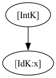
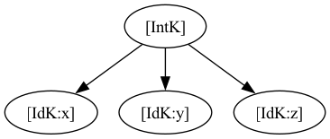
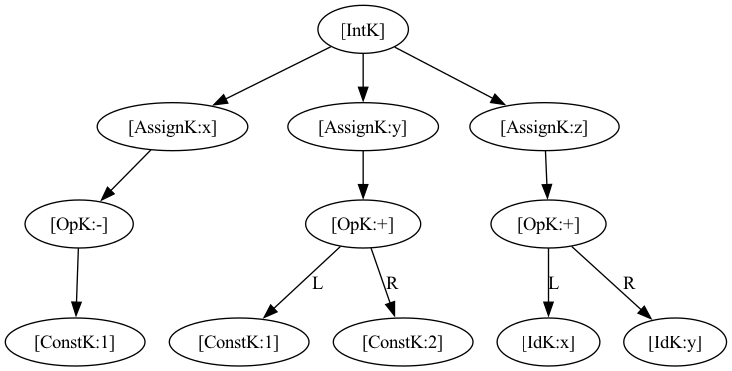

# 实验二：TINY编译器AST可视化与变量声明

## 实验目的

1. 参考MAKEDOT.C和MAKEDOT.H，实现TINY编译器中AST的可视化
2. 为TINY语言添加变量声明语句 `int`，支持单变量声明、多变量声明及带初值的变量声明
3. 构造相应的AST并输出Graphviz DOT格式文件，生成可视化图形

## 实验内容

### 1. AST可视化实现

在MAIN.C中集成MAKEDOT模块，在语法分析完成后自动生成DOT格式文件：

```c
// MAIN.C 中新增代码
#include "makedot.h"

// 在 parse() 之后添加
if (!Error)
{ char * dotfile;
  int fnlen = strcspn(pgm,".");
  dotfile = (char *) calloc(fnlen+5, sizeof(char));
  strncpy(dotfile,pgm,fnlen);
  dotfile[fnlen] = '\0';
  strcat(dotfile,".dot");
  outputGraphvizFormat(dotfile,syntaxTree);
  fprintf(listing,"\nAST Graphviz file generated: %s\n",dotfile);
  free(dotfile);
}
```

同时修复了MAKEDOT.C中的若干问题：
- 将 `treeNode` 统一改为 `TreeNode`（使用typedef名称）
- 将全局变量 `index` 重命名为 `op_index`，避免与POSIX的 `index()` 函数冲突
- 修正 `optab` 数组使其与 `TokenType` 枚举值正确对应（添加了FLOAT、COMMA、INT项）
- 为 `IntK` case添加了缺失的 `break` 语句
- 将OpK的单目运算符判断从特定运算符检查（原为PP）改为通用判断 `child[1] == NULL`

### 2. 添加变量声明功能

#### 2.1 词法分析器修改（SCAN.C / GLOBALS.H）

**GLOBALS.H** — 新增token和语句类型：

```c
// TokenType枚举中新增
INT,        // 保留字 int
COMMA       // 逗号 ,

// StmtKind枚举中新增
IntK        // 变量声明语句节点

// MAXRESERVED 从8改为9
#define MAXRESERVED 9
```

**SCAN.C** — 识别新token：

```c
// 保留字表新增
{"int",INT}

// DFA中新增逗号识别
case ',':
  currentToken = COMMA;
  break;
```

#### 2.2 语法分析器修改（PARSE.C）

新增 `int_stmt()` 函数，支持的语法规则：

```
int_stmt → INT var_decl { , var_decl } ;
var_decl → ID [ := exp ]
```

AST节点结构：
- 未初始化变量：IntK节点的child为IdK节点
- 带初值变量：IntK节点的child为AssignK节点，AssignK的child为表达式子树

```c
TreeNode * int_stmt(void)
{ TreeNode * t = newStmtNode(IntK);
  match(INT);
  int child_idx = 0;
  /* 解析第一个变量 */
  if ((t!=NULL) && (token==ID))
  { char * name = copyString(tokenString);
    match(ID);
    if (token==ASSIGN)
    { /* 带初值: int x := exp */
      match(ASSIGN);
      TreeNode * assign = newStmtNode(AssignK);
      if (assign!=NULL)
      { assign->attr.name = name;
        assign->child[0] = exp();
      }
      if (child_idx < MAXCHILDREN) t->child[child_idx] = assign;
    }
    else
    { /* 无初值: int x */
      TreeNode * id_node = newExpNode(IdK);
      if (id_node!=NULL) id_node->attr.name = name;
      if (child_idx < MAXCHILDREN) t->child[child_idx] = id_node;
    }
    child_idx++;
  }
  /* 解析后续变量（逗号分隔） */
  while (token==COMMA && child_idx < MAXCHILDREN)
  { match(COMMA);
    if (token==ID)
    { char * name = copyString(tokenString);
      match(ID);
      if (token==ASSIGN)
      { match(ASSIGN);
        TreeNode * assign = newStmtNode(AssignK);
        if (assign!=NULL)
        { assign->attr.name = name;
          assign->child[0] = exp();
        }
        if (child_idx < MAXCHILDREN) t->child[child_idx] = assign;
      }
      else
      { TreeNode * id_node = newExpNode(IdK);
        if (id_node!=NULL) id_node->attr.name = name;
        if (child_idx < MAXCHILDREN) t->child[child_idx] = id_node;
      }
      child_idx++;
    }
  }
  match(SEMI);
  return t;
}
```

同时在 `statement()` 中添加 `case INT` 分发，并在 `factor()` 中添加一元减号支持：

```c
case MINUS :
  match(MINUS);
  t = newExpNode(OpK);
  if (t!=NULL)
  { t->attr.op = MINUS;
    t->child[0] = factor();
  }
  break;
```

#### 2.3 语义分析器修改（ANALYZE.C）

`insertNode` 中添加IntK处理，遍历子节点将变量名插入符号表：

```c
case IntK:
  { int i;
    for (i=0; i < MAXCHILDREN; i++)
    { if (t->child[i] != NULL)
      { char * name = NULL;
        if (t->child[i]->nodekind == ExpK && t->child[i]->kind.exp == IdK)
          name = t->child[i]->attr.name;
        else if (t->child[i]->nodekind == StmtK && t->child[i]->kind.stmt == AssignK)
          name = t->child[i]->attr.name;
        if (name != NULL && st_lookup(name) == -1)
          st_insert(name,t->lineno,location++);
      }
    }
  }
  break;
```

`checkNode` 中修复OpK的类型检查，支持单目运算符（child[1]可能为NULL）：

```c
case OpK:
  if (t->child[1] == NULL) {
    /* 单目运算符 */
    if (t->child[0]->type != Integer)
      typeError(t,"Op applied to non-integer");
  } else {
    if ((t->child[0]->type != Integer) ||
        (t->child[1]->type != Integer))
      typeError(t,"Op applied to non-integer");
  }
  ...
```

#### 2.4 代码生成器修改（CGEN.C）

`genStmt` 中添加IntK处理，对带初值的变量生成赋值代码：

```c
case IntK:
  { int i;
    for (i=0; i < MAXCHILDREN; i++)
    { if (tree->child[i] != NULL)
      { if (tree->child[i]->nodekind == StmtK &&
            tree->child[i]->kind.stmt == AssignK)
          cGen(tree->child[i]);
      }
    }
  }
  break;
```

`genExp` 中添加单目减号代码生成：

```c
case OpK:
  ...
  if (p2 == NULL) {
    /* 单目运算符 */
    cGen(p1);
    switch (tree->attr.op) {
       case MINUS :
          emitRM("LDC",ac1,0,0,"load 0 for unary minus");
          emitRO("SUB",ac,ac1,ac,"op unary -");
          break;
       ...
    }
  } else {
    /* 原有的双目运算符处理 */
    ...
  }
```

#### 2.5 工具函数修改（UTIL.C）

- `printToken` 添加 INT、COMMA 的输出
- `printTree` 添加 IntK 节点的打印

## 实验结果

### 测试1：单变量声明 `int x;`

**测试程序** (`test_int1.tny`)：
```
int x;
```

**语法树输出**：
```
Int
  Id: x
```

**AST可视化图**：



AST结构：IntK节点包含一个子节点IdK(x)。

### 测试2：多变量声明 `int x,y,z;`

**测试程序** (`test_int2.tny`)：
```
int x,y,z;
```

**语法树输出**：
```
Int
  Id: x
  Id: y
  Id: z
```

**AST可视化图**：



AST结构：IntK节点包含三个子节点IdK(x)、IdK(y)、IdK(z)，分别对应三个变量。

### 测试3（选做）：带初值的变量声明 `int x:=-1, y:=1+2, z:=x+y;`

**测试程序** (`test_int3.tny`)：
```
int x:=-1, y:=1+2, z:=x+y;
```

**语法树输出**：
```
Int
  Assign to: x
    Op: -
      Const: 1
  Assign to: y
    Op: +
      Const: 1
      Const: 2
  Assign to: z
    Op: +
      Id: x
      Id: y
```

**AST可视化图**：



AST结构：IntK节点包含三个AssignK子节点：
- `AssignK(x)` → `OpK(-)` → `ConstK(1)` （一元减号，单目运算）
- `AssignK(y)` → `OpK(+)` → `ConstK(1)`(L), `ConstK(2)`(R) （双目加法）
- `AssignK(z)` → `OpK(+)` → `IdK(x)`(L), `IdK(y)`(R) （双目加法，引用已声明变量）

## 修改文件清单

| 文件 | 修改内容 |
|------|----------|
| GLOBALS.H | 新增 INT、COMMA token；新增 IntK 语句类型；MAXRESERVED 改为 9 |
| SCAN.C | 新增 "int" 保留字；新增逗号识别 |
| PARSE.C | 新增 int_stmt() 函数；statement() 添加 INT 分发；factor() 添加一元减号 |
| UTIL.C | printToken 添加 INT、COMMA；printTree 添加 IntK |
| ANALYZE.C | insertNode 添加 IntK 处理；checkNode 修复 OpK 单目运算符支持 |
| CGEN.C | genStmt 添加 IntK 处理；genExp 添加单目减号代码生成 |
| MAKEDOT.C | 修复 optab 与枚举对应；修复 IntK break；修复 treeNode→TreeNode；index→op_index；通用单目运算符处理 |
| MAKEDOT.H | treeNode → TreeNode |
| MAIN.C | 包含 makedot.h；添加 DOT 文件生成调用 |

## 编译与运行

```bash
# 编译TINY编译器
cd TC
gcc -w -x c -std=c89 -o tiny MAIN.C UTIL.C SCAN.C PARSE.C SYMTAB.C ANALYZE.C CODE.C CGEN.C MAKEDOT.C

# 运行测试
./tiny test_int1.tny    # 单变量声明
./tiny test_int2.tny    # 多变量声明
./tiny test_int3.tny    # 带初值的变量声明

# 生成AST可视化图片
dot -Tpng test_int1.dot -o test_int1.png
dot -Tpng test_int2.dot -o test_int2.png
dot -Tpng test_int3.dot -o test_int3.png
```
